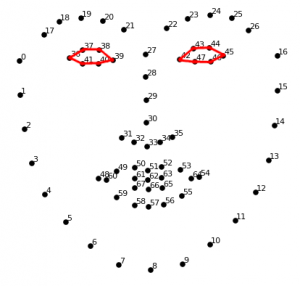
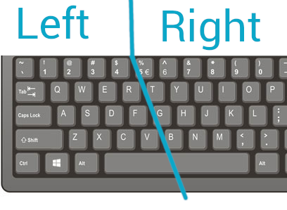

# 环境提醒：注意一定要dlib 一定要和python版本号要对应上，不然装的时候可能会出现一些问题
[dlib 安装](https://blog.csdn.net/ljflinux/article/details/104286540?spm=1000.2123.3001.4430)

## 01.人眼检测,定位到人眼，找到人眼的中心

我们需要分别检测两个眼睛
Left eye points: (36, 37, 38, 39, 40, 41)

Right eye points: (42, 43, 44, 45, 46, 47)

## 02.定位人眼的瞳孔 与眨眼检测
[查找轮廓](https://www.cnblogs.com/dcxh/p/13505471.html) 

### 03 定位瞳孔 ,眼球转动

### 04 05 凝视检测

### 06 左右键盘
    当我们的眼睛向左看时键盘左半部分显示，
    当我们的眼睛向又看时键盘的右半部分显示，
    The idea is to see a keyboard on the screen, light up each key every second or so and when the key we’re insterested in is on, 
    simply we close our eyes.
    If we consider that the keyboard has 26 letters of the alphabet, plus we need the space and some other key, 
    just to run through all the keys lighting up each for one second, it will take half a mintue each time.
    The idea is to devide the keyboard in two parts. If we look on the left side only the left part of the keyboard will be activated, 
    while if we look on the right side only the letter on the right part of the keyboard will light up
 

### 07 
### 08 闭眼的时候选中键盘的 字母，在 空白写字板中打出
        闭眼之前已经选中，闭眼是为了激活

### 09 加音效

## 10. eye_detection_p10  是完整的代码

## 11.[参考链接](https://pysource.com/2019/02/07/write-using-your-eyes-gaze-controlled-keyboard-with-python-and-opencv-p-10/)